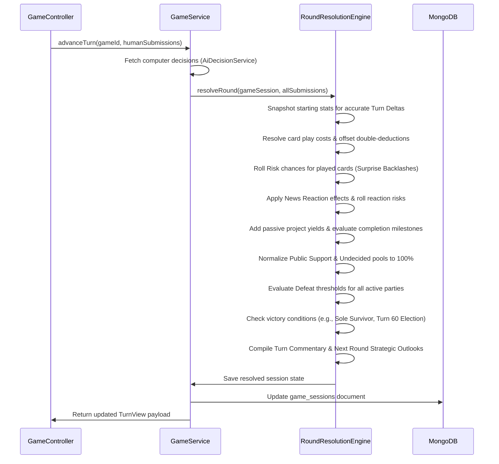

# Game Design & Technical Walkthrough

Welcome to the central walkthrough for the **Indian Politics Strategy Simulation**. This document compiles the gameplay mechanics, backend architecture, database layouts, and AI decision-making systems into a single comprehensive manual.

---

## 🎮 Part 1: Gameplay & Simulation Mechanics

The game is a turn-based political strategy simulation inspired by Indian state assembly campaign dynamics. Players manage resources, respond to media headlines, allocate project funds, bid on rewards, and play cards to gain political office.

### 1. Game Flow & Turn Structure
Each game takes place within a state scenario (e.g., **West Bengal 2001**). The campaign spans an election cycle of exactly **60 turns** (where `1 turn = 1 month`). 
Elections are held dynamically if a government falls, or automatically on Turn 60.

On each monthly turn, players step through a structured wizard interface:
1.  **Select Strategy Card**: Play one political campaign card from a role-specific deck of 30 cards. Cards have costs, targeting rules, risk profiles, and delayed effects. Standard cards can be played a maximum of **2 times per game** (persistent across election cycles) to prevent repetitive spam.
2.  **Target Selection**: Select a rival party (e.g., *Tiger Front*, *Peacock Party*) to receive target-specific card effects.
3.  **Play Inventory Reward (Optional)**: Deploy a booster reward (e.g., *Grassroots Boost*) won during a previous bidding cycle.
4.  **External News Reaction**: React to the monthly state-wide news event (rendered in a vintage printed newspaper theme: **The State Chronicle**). Select one of four responses.
5.  **Monthly Governance Issue**: Resolve an internal policy decision or local challenge (rendered in an urgent **TV Breaking News** frame).
6.  **Place Bids & Lock Turn**: Place a blind resource bid (using Coins, Morale, or Public Support) for the ongoing 5-turn cycle reward.

Once all players lock their turns, the round resolves, applying all actions and advancing the timeline.

---

### 2. Core Political Party Stats
Every party tracks 5 visible metrics:

| Stat | Range | Purpose |
| :--- | :--- | :--- |
| **Coins** | $\ge 0$ | Spendable budget. Reaching $\le 0$ triggers immediate defeat (bankrupt). |
| **Party Morale** | $0-100$ | Cadre discipline and energy. Reaching $< 10$ triggers party collapse defeat. |
| **Corruption Score** | $0-100$ | Suspicion level. Higher score boosts the probability that accusations resolve in a scandal. |
| **Media Image** | $0-100$ | Press favorability. Affects card results and public support conversion. |
| **Public Support** | $0-100\%$ | Vote share. Reaching $< 10\%$ triggers party collapse defeat. |

#### Public Support & Undecided Voter movement:
*   Support does not grow linearly. Card and reaction outcomes apply **support pressure** rather than direct vote share.
*   At round end, the engine normalizes all party support and the **Undecided Voters** pool to equal exactly 100%.
*   Voter movement is slow:
    *   Minor pressure ($+1$ or $+2$) rarely shifts actual vote shares.
    *   Strong positive pressure can convert up to **2%** of Undecided voters per turn.
    *   Negative pressure can release up to **3%** of a party's support back into the Undecided pool.

---

### 3. Card & News Content Metadata
All cards, news events, and projects are defined via editable metadata (stored in MongoDB), enabling rules tuning without code recompilation.

#### Standard Card Metadata Example:
```yaml
id: expose_teacher_admission_scam
name: Expose Teacher Admission Scam
category: scandal_accusation
role_allowed: ["opposition"]
cost: 14
target:
  government: true
  opposition: true
  public: true
effects:
  scheduled:
    - label: first_public_reaction
      timing: { min_turns: 1, max_turns: 1 }
      visible: true
      effects:
        government: { coins: 0, party_morale: -1, corruption_score: 4, media_image: -3, public_support: -1 }
        opposition: { coins: -14, party_morale: 2, corruption_score: 0, media_image: 2, public_support: 1 }
        public: { undecided_support: 0, public_mood: -1 }
    - label: scandal_resolution
      timing: { min_turns: 2, max_turns: 5 }
      visible: true
      chance_table:
        proven_true:
          weight: 25
          effects:
            government: { party_morale: -4, corruption_score: 8, media_image: -6, public_support: -5 }
            opposition: { party_morale: 3, media_image: 4, public_support: 4 }
        proven_false:
          weight: 20
          effects:
            government: { party_morale: 2, corruption_score: -2, media_image: 3, public_support: 3 }
            opposition: { party_morale: -4, media_image: -5, public_support: -5 }
risk_roll:
  chance: 20
  bad_outcome: "Accusation is seen as politically motivated."
  effects:
    opposition: { party_morale: -2, media_image: -2, public_support: -1 }
```

#### News Reaction Metadata Example:
```yaml
id: fuel_price_rise_oct_2020
type: external
title: Fuel Prices Rise Across The State
reaction_options:
  - id: blame_government
    text: "Blame the government for poor price control."
    role_allowed: ["opposition"]
    effects:
      player_party: { party_morale: 2, corruption_score: 0, media_image: 1, public_support: 2 }
    risk:
      chance: 20
      bad_outcome: "Public sees it as routine blame politics."
      effects:
        player_party: { media_image: -2, public_support: -1 }
```

---

### 4. Infrastructure Building Projects
Apart from playing cards, parties can invest in long-term building projects (e.g., *Mega Rally*, *Prime Leader Visit*, *Audit Harassment*, *Media Smear*).

*   **Multi-Metric Cost**: Progressing a project can cost combinations of Coins, Morale, Media Image, or Support.
*   **Incremental Funding**: Parties can choose to fund a project step-by-step.
*   **Persistent Yields**: Once progress reaches 100%, the project is active and provides automated per-turn yields (e.g., +6 Coins, +1% Support) designed to pay back construction costs within 10 turns.
*   **Spawning Duplicate Drafts**: When a project is completed (100%), a fresh 0% progress draft version of that project type is added to the list, allowing players to build multiple instances of the same infrastructure.

---

## 🛠️ Part 2: Backend Architecture & Systems

The game backend is a Spring Boot application connecting to MongoDB, serving a React UI and a Streamlit developer tool.

### 1. File Packages & Responsibilities
```text
backend/src/main/java/com/politicalsim/
  ├── api/                 # REST Controllers (Game, Admin, Turn APIs)
  ├── auth/                # Google OAuth 2.0 and Developer bypass auth
  ├── content/             # MongoDB-backed static rules (Seeders, Definitions, Caches)
  ├── game/                # Active game session management & persistence
  │     ├── GameSession.java            # Main Document Model
  │     ├── RoundResolutionEngine.java  # Turn resolution math & logic
  │     └── GameService.java            # Session actions (Bids, projects, AI moves)
  ├── party/               # Party statistics, roles, and project state schemas
  ├── publicmood/          # Public state representation
  └── ai/                  # AI profile and decision scoring
```

### 2. Primary Database Collections
MongoDB holds state in the following schemas:
*   `game_sessions`: Complete active/saved game states, history logs, grudge tracking, and active projects.
*   `scenario_definitions`: Setup rules, start state profiles, and state lock maps.
*   `card_definitions`: 30 strategy card rules scoped per scenario.
*   `news_definitions`: External monthly events and reaction lists.
*   `users`: Logged-in user accounts and campaign era progression metrics.

---

### 3. Turn Resolution Cycle
When `advanceTurn` is called, the `RoundResolutionEngine` processes calculations in the following sequence:



---

## 🤖 Part 3: AI Decision-Making Engine

The computer-controlled parties make smart monthly decisions designed to protect their survival while aggressively targeting rival weaknesses.

### 1. AI Profiles
Every computer party is seeded with an `AiProfile` mapping tactical scalars and weights:
```json
{
  "style": "AGGRESSIVE_POPULIST",
  "riskTolerance": 0.7,
  "scandalPreference": 0.8,
  "welfarePreference": 0.5,
  "coalitionPreference": 0.4,
  "mediaPreference": 0.65,
  "ideologyStrictness": 0.75,
  "intentThresholds": {
    "governmentNoConfidenceSupport": 30.0,
    "lowCoins": 100.0,
    "corruptionCrisis": 50.0
  },
  "scoringWeights": {
    "selfPublicSupport": 4.0,
    "intentFit": 8.0,
    "categoryPreference": 5.0
  }
}
```

---

### 2. Intent Selection Heuristics
Before scoring any cards, the AI scans game metrics and assigns a single strategic intent for the month:
*   `SURVIVE_SCANDAL`: Selected if Corruption is dangerously high ($\ge 50$).
*   `RESTORE_MORALE`: Selected if Morale is low ($< 50$).
*   `RAISE_FUNDS`: Selected if Coins are critical ($< 100$).
*   `GAIN_SUPPORT`: Selected if support drops near the $10\%$ elimination boundary.
*   `ATTACK_RIVAL`: Selected if the AI is healthy and finds vulnerable opponents.

---

### 3. Card Selection & Scoring Logic
The AI evaluates all cards allowed for its current role and plays the card returning the highest score:
$$\text{Score} = \text{BasePlayWeight} + \text{IntentFitBonus} + \text{IdeologyAlignment} + \text{AffordabilityFactor} - \text{SafetyPenalties} - \text{VarietyPenalty}$$

#### Tactical Penalties & Bypasses:
*   **Dynamic Coin Safety**: If a card's cost would push the AI's coins below 100, 75, 50, or 25, progressive penalties are applied (up to $-80$ points). However, if the AI is *already* in a coin crisis ($< 100$) and the card *increases* net coins, the penalty is bypassed, and a recovery boost of `netCoins * 2.5` is added.
*   **Dynamic Morale Safety**: Cards leaving morale below 50, 35, 25, or 15 are heavily penalized. If morale is already low ($< 50$) and the card restores morale, it receives a recovery boost of `netMorale * 3.0`.
*   **Variety Penalty**: To prevent playing the same card repeatedly, candidates matching the card played by the AI in the previous turn are hit with a **$-35.0$ points penalty**.

---

### 4. Bidding & Project Resource Constraints
To ensure the AI does not spend itself to death on optional components:
*   **Safety Bidding**: AI players bid on cycle rewards using calculated resource utility. However, if any critical warning boundaries are active (Coins $\le 20$, Morale $\le 18$, Support $\le 10\%$, Corruption $\ge 75\%$), or if a tie/win is mathematically impossible, the AI automatically bids **0** to conserve resources.
*   **10% Project Spend Cap**: The AI will only fund infrastructure projects if it is in a healthy state (Coins $> 100$, Morale $> 50$). Even when funding is enabled, the AI caps project spending at a maximum of **10%** of its current Coins and **10%** of its current Morale per turn, preventing instant cash drains.

---

### 5. AI Rivalry & Targeting (Grudges)
The AI targets rivals dynamically based on the following indicators:
*   **Weakness Targeting**: Opponent target scores are boosted if they are near warning levels, allowing the AI to coordinate a knockout blow.
*   **Grudge Retaliation**: If a human or rival party targets the AI with an offensive card or a hostile project outcome, the AI adds Grudge points to that party. In subsequent rounds, a Grudge multiplier ($+10.0$ points per grudge level) is added to favor target retaliation.
